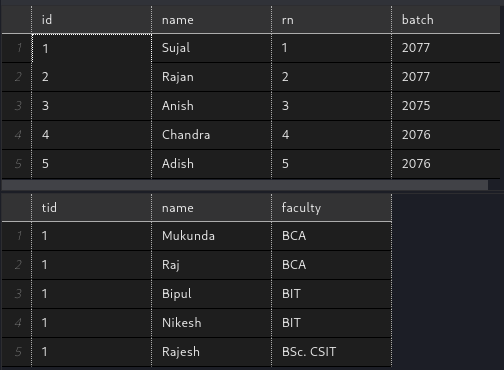
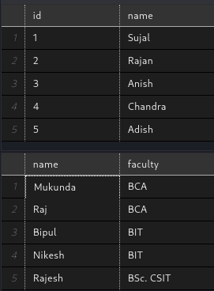
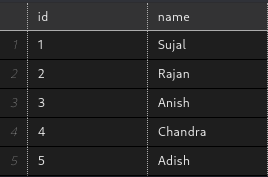

<!--Add variables above-->

<!--left right margins are fucked-->
<!--set a4 page layout. check variables for wkhtmltopdf in man page-->

<!-- For wkhtmltopdf, tiled isn't supported so use relative paths? -->


**TRIBHUVAN UNIVERSITY**

**FACULTY OF HUMANITIES AND SOCIAL SCIENCE**


**HIMALAYA COLLEGE OF ENGINEERING**

<!-- draw bars natively with md or groff? -->


**Lab Report Title: Basic SQL queries**

Submitted by: Submitted to:

Roll number: Department of BCA

BCA 4th Semester Submission Date:

<div style="page-break-after: always;"></div>

# OBJECTIVES

-   To learn basic SQL operations through DDL, DML & DQL commands

-   To work with Microsoft's SQL Server relational database

# THEORY

Databases are an integral part of the IT industry, allowing developers
to organize large amounts of data & perform operations. This data may be
customer info, inventory records & much more. Database Management
Systems (DBMS) are software allowing us to interact with, view & modify
databases.

There are different implementations of DBMS, with Relational being a
popular and easy-to-use one. Data is organized into relations(tables)
with columns representing attributes & rows representing different
records. For the purposes of this lab, we used SQL Server, Microsoft's
own RDBMS. Similar results can be achieved with other RDBMSs as they all
use the Structured Query Language(SQL) programming language.

SQL commands are categorized based on their function. The 3 basic
categories we learned were:

-   Data Definition Language (DDL): to create, modify database objects,
    > schema

-   Data Manipulation Language (DML): to add, modify data inside objects

-   Data Query Language (DQL): to retrieve data

# LAB WORK

Create a database HCOE2077 & create tables with the following schema:\
- Student (id, name, rn, batch)\
- Teacher (tid, name, faculty)

1.  Insert any 5 records in each table

```sql
use HCOE2077

insert into student(id, name, rn, batch) values(1, 'Sujal', 1, 2077),
(2, 'Rajan', 2, 2077),
(3, 'Anish', 3, 2075),
(4, 'Chandra', 4, 2076),
(5, 'Adish', 5, 2076)

insert into teacher(tid, name, faculty) values(1, 'Mukunda', 'BCA'),
(1, 'Raj', 'BCA'),
(1, 'Bipul', 'BIT'),
(1, 'Nikesh', 'BIT'),
(1, 'Rajesh', 'BSc. CSIT')
```

2.  Display all records
```sql
select * from student
select * from teacher
```
Output: 



3.  Display only id & name from student table

4.  Display name & faculty from teacher
```sql
use HCOE2077
select id, name from student
select name, faculty from teacher
```

Output: 

5.  Remove 'rn' attribute from student
```sql 
alter table student drop column rn
```

6.  Add 'salary' attribute to teacher relation
```sql
alter table teacher add salary int
```

7.  Copy `id` & `name` attribute to new relation `info_student`
```sql
select id, name into info_student from student 
select * from info_student
``` 
Output: 

8. Delete all contents from `info-student` relation
```SQL
delete from info_student
```


## CONCLUSION
Thus, we were introduced to using databases. We learned to create relations, store data in them, & modify both tables & their data using appropriate SQL commands. 
